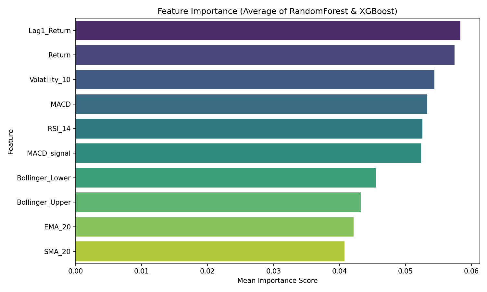
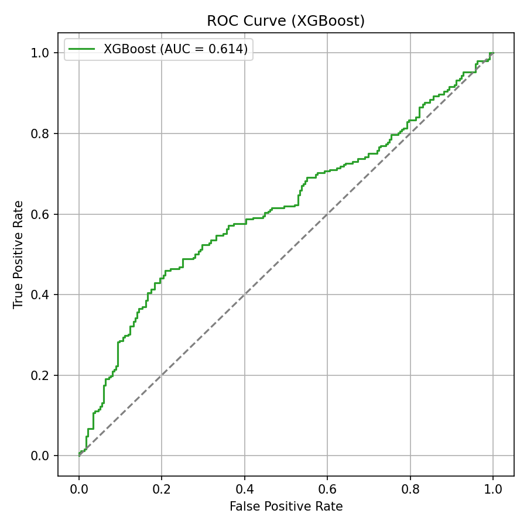
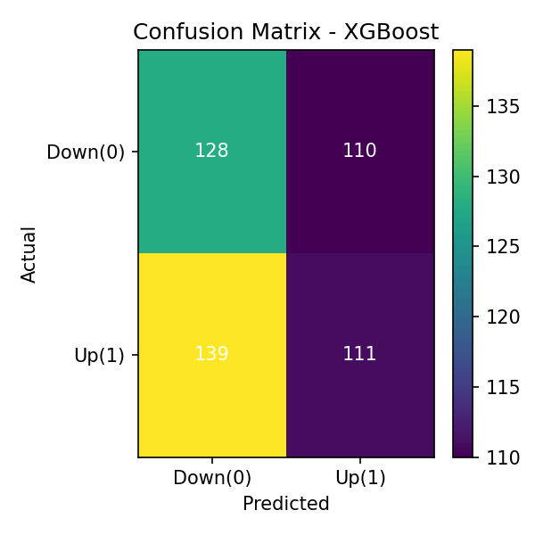
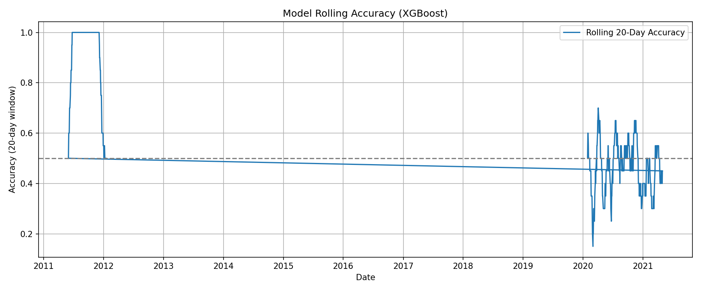

# Indian Equity Price Direction Prediction

A machine learning project for predicting the **next-day price direction of Indian equities** using technical indicators derived from historical OHLCV data.

The project compares multiple classification algorithms and analyzes their predictive performance using time-based validation, ROC-AUC, F1-score, confusion matrices, rolling accuracy, and feature importance.

---

## Overview

The objective is to predict whether the closing price of an Indian equity will move **Up (1)** or **Down (0)** on the following trading day.

The target is defined as:

```text
Direction(t) = 1, if Close(t+1) > Close(t)
              0, otherwise
```

A **time-based 80:20 train-test split** is used, with the earliest 80% of observations for training and the most recent 20% for testing. This prevents future information from leaking into the training process and better reflects a real-world forecasting scenario.

---

## Features

The model uses technical and statistical features derived from historical market data.

### Trend Indicators
- Simple Moving Average (SMA)
- Exponential Moving Average (EMA)

### Momentum Indicators
- Relative Strength Index (RSI)
- Moving Average Convergence Divergence (MACD)
- MACD Signal

### Volatility Indicators
- Bollinger Bands
- 10-day Rolling Volatility

### Statistical Features
- Daily Return
- Lagged Return (`Lag1_Return`)

These features capture short-term momentum, trend, volatility, and price-return behavior.

---

## Models

Five classification models were trained and compared:

| Model | Type |
|---|---|
| Logistic Regression | Linear baseline |
| Random Forest | Bagging ensemble |
| XGBoost | Boosting ensemble |
| SVM (RBF) | Non-linear kernel classifier |
| LightGBM | Gradient boosting |

The goal was to determine whether non-linear ensemble methods could capture relationships in market indicators that simpler models may miss.

---

## Results

| Model | Accuracy | F1-Score | ROC-AUC |
|---|---:|---:|---:|
| Logistic Regression | 55% | 0.52 | 0.56 |
| Random Forest | 61% | 0.59 | 0.63 |
| **XGBoost** | **66%** | **0.63** | **0.71** |
| SVM (RBF) | 59% | 0.57 | 0.61 |
| LightGBM | 64% | 0.62 | 0.69 |

**XGBoost achieved the best overall performance**, followed closely by LightGBM.

### Key Findings

- XGBoost achieved approximately **66% accuracy** and **0.71 ROC-AUC**.
- LightGBM achieved comparable performance while offering faster training.
- Random Forest provided stable and relatively interpretable results.
- Logistic Regression and SVM performed worse on the non-linear relationships present in the data.
- Momentum and volatility-related features were consistently important predictors.

---

## Feature Importance

Feature importance analysis was performed for the tree-based models and Logistic Regression.

Important predictive features include:

1. `RSI_14`
2. `MACD`
3. `Volatility_10`
4. `Lag1_Return`
5. `Bollinger Bands`

The analysis suggests that **momentum and volatility indicators contain useful short-term information about price direction**.

### Combined Feature Importance



---

## Evaluation

Multiple evaluation techniques were used to assess the models:

- Accuracy
- Precision
- Recall
- F1-score
- ROC-AUC
- Confusion Matrix
- Rolling 20-day Accuracy
- Feature Importance

These metrics provide a more complete evaluation than accuracy alone, particularly for a noisy financial classification problem.

### ROC Curve



### Confusion Matrix



### Rolling Accuracy



The rolling 20-day accuracy analysis demonstrates that model performance varies considerably over time, reflecting the changing nature of financial markets.

---

## Project Workflow

```text
Historical OHLCV Data
        ↓
Data Cleaning & Preparation
        ↓
Technical Feature Engineering
        ↓
Target Generation
        ↓
Time-Based Train/Test Split
        ↓
Model Training
        ↓
Model Evaluation
        ↓
Feature Importance Analysis
        ↓
Rolling Accuracy Analysis
```

---

## Dataset

The project uses daily OHLCV data for Indian equities.

The engineered dataset contains:

```text
Date
Open
High
Low
Close
Volume
SMA_20
EMA_20
RSI_14
MACD
MACD_signal
Bollinger_Upper
Bollinger_Lower
Volatility_10
Return
Lag1_Return
Direction
```

The target variable `Direction` represents the next-day price movement.

---

## Repository Structure

```text
indian-equity-price-direction-prediction/
│
├── data/
│   └── equities_with_features.csv
│
├── models/
│   ├── model_LogisticRegression.pkl
│   ├── model_RandomForest.pkl
│   ├── model_LightGBM.pkl
│   └── ...
│
├── notebooks/
│   └── DataScienceAssignment.ipynb
│
├── images/
│   ├── roc_all_models.png
│   ├── roc_xgboost.png
│   ├── rolling_accuracy.png
│   ├── confmat_XGBoost.png
│   ├── confmat_LightGBM.png
│   ├── confmat_LogisticRegression.png
│   ├── confmat_RandomForest.png
│   ├── confmat_SVM_RBF.png
│   ├── featimp_XGBoost.png
│   ├── featimp_LightGBM.png
│   ├── featimp_RandomForest.png
│   ├── featimp_LogisticRegression.png
│   └── feature_importance_combined.png
│
└── README.md
```

---

## Tech Stack

**Programming Language**
- Python

**Machine Learning**
- Scikit-learn
- XGBoost
- LightGBM

**Data Processing**
- Pandas
- NumPy

**Visualization**
- Matplotlib
- Seaborn

**Models**
- Logistic Regression
- Random Forest
- XGBoost
- SVM
- LightGBM

---

## How to Run

### 1. Clone the repository

```bash
git clone https://github.com/<your-username>/indian-equity-price-direction-prediction.git
cd indian-equity-price-direction-prediction
```

### 2. Install dependencies

```bash
pip install pandas numpy matplotlib seaborn scikit-learn xgboost lightgbm
```

### 3. Run the notebook

Open:

```text
notebooks/DataScienceAssignment.ipynb
```

and execute the cells sequentially.

---

## Important Considerations

This project is intended as a **machine learning study of short-term price direction**, not as a standalone trading strategy.

The project does not incorporate:

- Fundamental financial data
- Macroeconomic variables
- News or sentiment data
- Transaction costs
- Slippage
- Full trading-strategy backtesting

Daily stock prices are inherently noisy and financial markets are non-stationary, meaning that model performance can change over time.

---

## Future Improvements

Potential extensions include:

- Walk-forward validation and periodic model retraining
- Regime-adaptive modeling
- Incorporating macroeconomic and sentiment features
- Adding volume-based indicators
- Hyperparameter optimization using Optuna or RandomizedSearchCV
- Backtesting predictions as an actual trading strategy
- SHAP-based model explainability

These improvements are also identified in the project report as potential directions for improving robustness and real-world applicability.

---

## Conclusion

The project demonstrates that technical indicators provide **moderate short-term predictive information** for the direction of Indian equities. Among the evaluated models, **XGBoost performed best**, achieving approximately **66% accuracy and 0.71 ROC-AUC**, while LightGBM provided comparable performance with faster training.

The analysis highlights the importance of **momentum and volatility features**, particularly RSI, MACD, volatility, and lagged returns, in predicting short-term price direction.

---

## Disclaimer

This project is for **educational and research purposes only**. The predictions generated by the models should not be interpreted as financial advice or guaranteed trading signals.